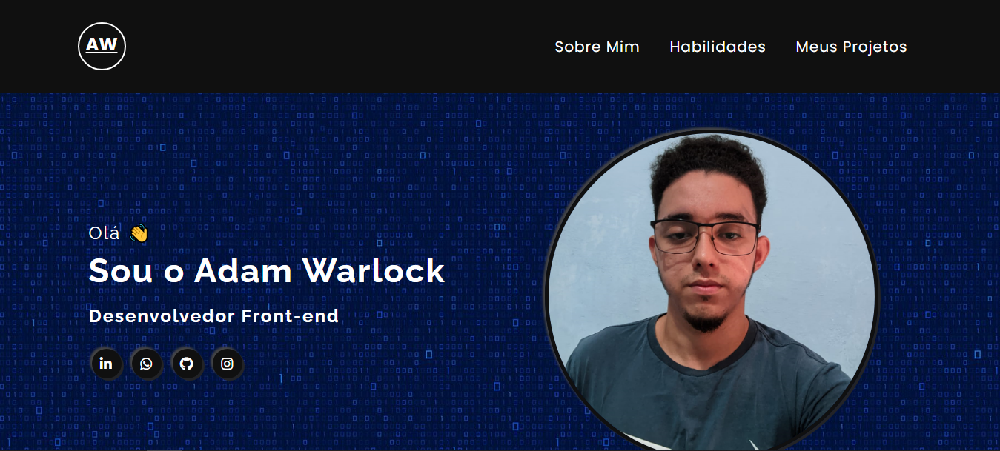

# Portfólio

Bem vindo ao repositório do meu portfólio.

Nele você podera ver minhas redes sociais, informações sobre mim, minhas habilidades e meus projetos.

## Linguagens usadas

- HTML 

- CSS 

## Prévia

Veja uma pequena prévia do meu portfólio.



Para ver mais detalhes acesse o github pages do portfólio <a src="">clicando aqui</a>.

## Passo a passo para clonar o projeto

Para clonar o projeto, você pode usar o terminal de sua preferência, o passo a passo a seguir usa os comandos do gitbash como exemplo.

1 - Abra um terminal onde deseja colocar o projeto

2 - Clone o projeto
```
git clone "url do projeto"
```
3 - Acesse a pasta do projeto
```
cd portfolio
```
4 - Abra no vscode
```
code .
```
5 - Execute o projeto usando o Live server